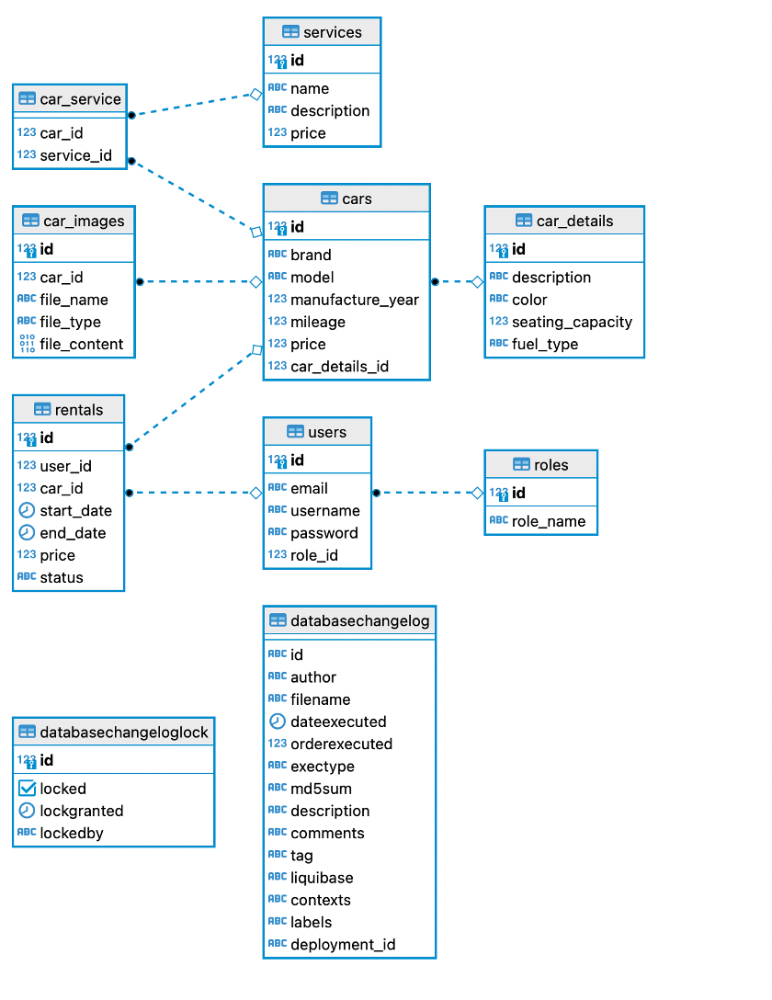

Start loacally:
```bash
java -jar spring-car-autopark.jar --spring.profiles.active=local
```

# Система за управление на автопарк със Spring Boot и REST API



## **Описание на задачата**
Целта на тази задача е да изградите система за управление на автопарк с използване на **Spring Boot**. Системата трябва да предоставя REST API, което ще позволява на потребителите да управляват:
- Автомобили(Car)
- Потребители(User)
- Наеми(Rental)
- Услуги(Services)

В рамките на задачата ще бъде използвано **JPA** за работа с база данни.
Dev tools за лесна разработка и **Liquibase** за миграция на база данни.Spring Actuator за мониторинг на приложението.
Spring Security за управление на достъпа до ресурсите.OpenAPI за документация на API.
---

## **Основни функционалности**

### **1. Управление на потребители (User Management):**
- Създаване, редактиране, изтриване на потребители.
- Показване на списък с всички потребители.
- **Потребител(User)**:
    - Уникален идентификатор (ID)
    - Name
    - Email
    - Role (USER, ADMIN)

### **2. Управление на автомобили (Car Management):**
- Създаване, редактиране, изтриване на автомобили.
- Показване на списък с всички автомобили в автопарка.
- **Автомобил**:
    - Уникален идентификатор (ID)
    - Марка
    - Модел
    - Година на производство
    - Пробег
    - Цена

### **3. Наеми (Rental Management):**
- Управление на наеми, свързани с потребителите и автомобилите.
- **Наем**:
    - Уникален идентификатор (ID)
    - Дата на започване и завършване
    - Цена
    - Състояние
- Показване на списък с всички наеми.

### **4. Услуги (Service Management):**
- Управление на услуги, които могат да бъдат извършвани на автомобилите.
- **Услуга**:
    - Име на услугата
    - Описание
    - Цена
- Показване на списък с всички услуги.

---

## **Релации между обектите**
- **User → Rental**: One-to-Many: Един потребител може да наема множество автомобили.
- **Car → Rental**: One-to-Many:  Един автомобил може да бъде наеман много пъти.
- **Car → Services**: Many-to-Many: Всеки автомобил може да имат много услуги (services), и всека услуга service може да бъде асоциран с много коли.
- **Car → Images**: One-to-Many: Един автомобил може да има много images.
- **Car → CarDetails**: Всеки автомобил има допълнителна информация чрез релация One-to-One с CarDetails.

### **Ключови обекти**
1. **User**: Потребителите, които могат да наемат коли.
2. **Car**: Автомобили в автопарка.
3. **Rental**: Релация между User и Car, която показва кой потребител е наел кой автомобил.
4. **Service**: Ремонтни услуги, които могат да бъдат извършвани на автомобилите.
5. **CarImage**: Картинки на автомобилите.
6. **CarDetails**: Допълнителна информация за автомобилите.

---

## **Технологии**
- **Spring Boot**: за създаване на RESTful API.
- **Spring Data JPA**: за работа с база данни.
- **HTML/JS**: за фронтенд страници в static resources.
- **Postgres**: за съхранение на данни.
- **OpenAPI**.

---

## **Стъпки за изпълнение**

### **1. Проектиране на база данни:**
- Създайте таблици за потребители, автомобили, наеми, услуги.
- Използвайте релационни връзки (**One-to-Many**, **Many-to-Many**) между таблиците.

### **2. Създаване на `entity`:**
- Създайте класове за всяка от основните таблици:
    - `User`
    - `Car`
    - `Rental`
    - `Service`
    - `CarImage`
    - `CarDetails`
- Използвайте анотации на JPA (`@Entity`, `@ManyToOne`, `@OneToMany`, `@ManyToMany`, `@JoinColumn`).

### **3. Създаване на REST контролери:**
- За всяка от основните функционалности създайте REST контролери, които ще обработват HTTP заявки (`GET`, `POST`, `PUT`, `DELETE`).
- Осигурете API методи за работа с наемите, услугите и записите за услуги.

### **4. Изграждане на фронтенд:**
- Създайте HTML страници с форма за добавяне на нови:
    - Автомобили
    - Потребители
    - Наеми
    - Услуги
- Използвайте JavaScript (`fetch API` или `AJAX`) за комуникация с бекенда.
- Приложете таблици за показване на данни.

### **5. Тестване на API:**
- Използвайте  **HTTP API Requests via IntelliJ IDEA**, за да проверите дали работят всички методи за:
    - Добавяне
    - Редактиране
    - Изтриване
    - Показване на данни

Integration Тестове с h2 database.

### **6. Допълнителни функции (по избор):**
- Добавете филтриране на наемите по дата или състояние.
- Създайте страници с подробности за автомобилите, наемите и услугите.

---

## **Изисквания**
### **1. Използване на Spring Boot за бекенд:**
- Работа с база данни чрез JPA.
- Напишете REST API контролери за всяка от основните функционалности.

### **2. Фронтенд с HTML, CSS и JavaScript:**
- Използвайте HTML за изграждане на интерфейс за всяка функционалност.
- Използвайте JavaScript за изпращане на заявки към бекенда и актуализиране на таблиците.

### **3. Система за управление на базата данни:**
- Използвайте **Liquibase** и **docker-compose** за управление на базата данни.

---

## **Бележка**
Тази система осигурява основата за управление на автопарк и може да бъде разширена с допълнителни функции като:
- Визуализация на данни в реално време.
- Интеграция с трети услуги за плащания или отчетност.
